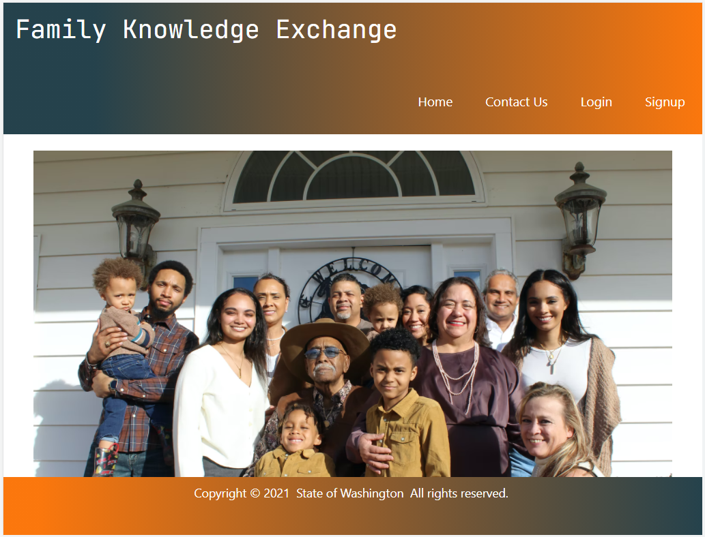
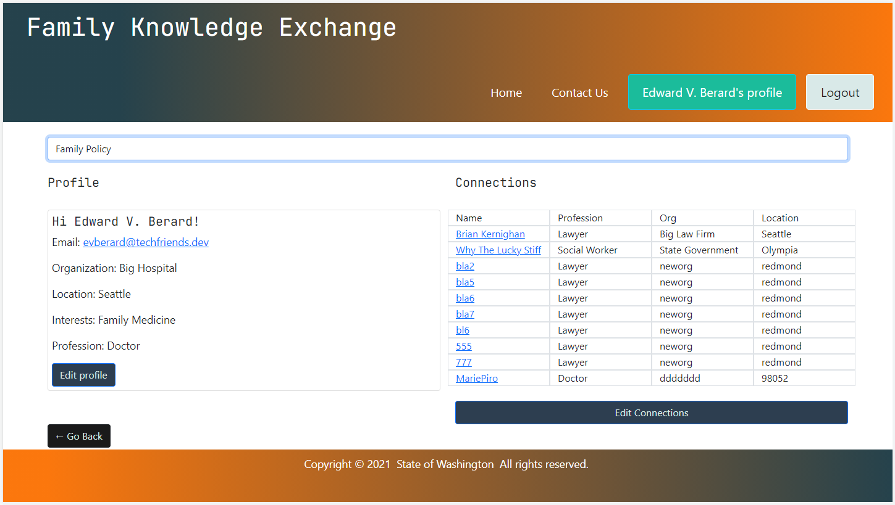

# family-knowledge-exchange

An application that links together different individuals and stakeholder groups interested in supporting families, allowing them to connect and share knowledge in their respectful fields.

[Github repo](https://github.com/ManuhuiaBarcham/family-knowledge-exchange.git)

[Heroku](https://fierce-island-14478.herokuapp.com/)

## About

A service that allows the user to sign in, providing them with the option to list their organization and field of interest then connects the user with individuals and stakeholders supporting families in that field.



## User Story

```
AS An individual supporting families
I WANT to be able to find other individuals supporting families in my field or other fields
SO THAT we can work share knowledge that can better help us in supporting families more effectively.

```



## Installation

- Download it through Github
- Run npm i or (npm install), make sure to download the jason package and inquirer.

## Usage

1. use `git clone ` to clone repo sources
2. create a branch with the `git checkout -b <your_branch_name>`
3. push your branch with `git push -u origin <your_branch_name>`
4. create a pull request for our review

## What's included

- Express.js
- React.js
- React-Bootstrap Styling Framework
- Built in HTML5 validation
- Node.js
- MongoDB
- Apollo-Server-Express
- GraphQL

## How can I contribute or help?

- Star our GitHub repo :star:
- Create pull requests, submit bugs, suggest new features or documentation updates :wrench:

## How to download the sources and contribute on the code

1. use `git clone ` to clone repo sources
2. create a branch with the `git checkout -b <your_branch_name>`
3. push your branch with `git push -u origin <your_branch_name>`
4. create a pull request for our review

## From developers

Made by [Manuhuia](https://github.com/ManuhuiaBarcham), [Consolata](https://github.com/Conso97), [Mariia](https://github.com/MaryVPie), [Kelebet](https://github.com/kelebetengida), and [Megan](https://github.com/eksem95).

## More from us

To be updated with new project updates. 
